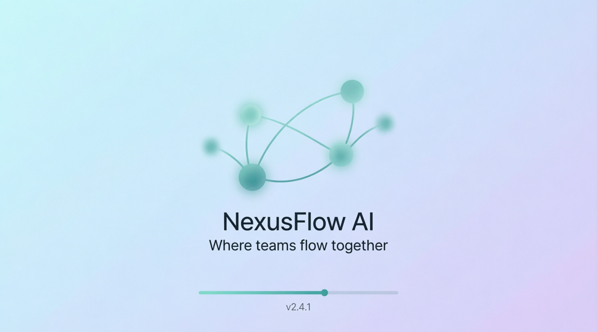
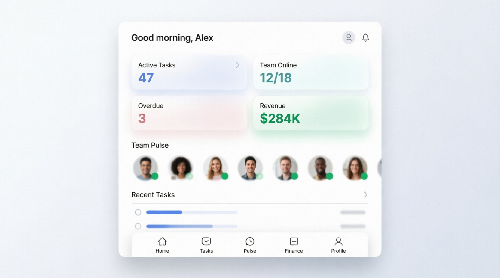
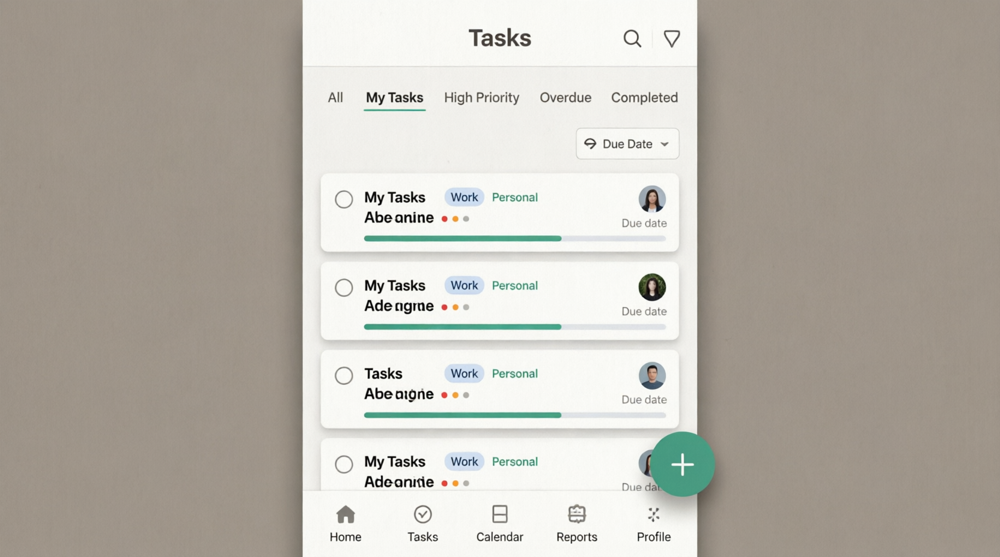
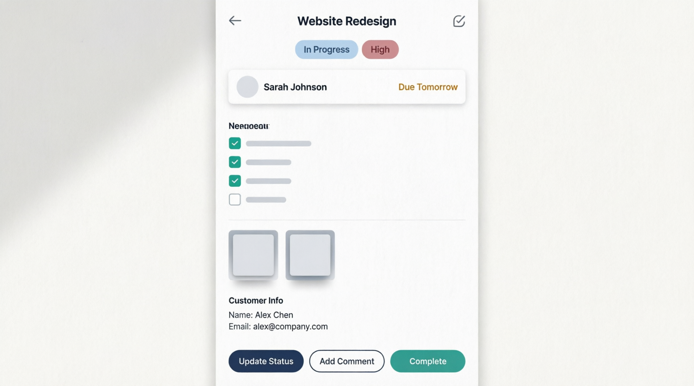
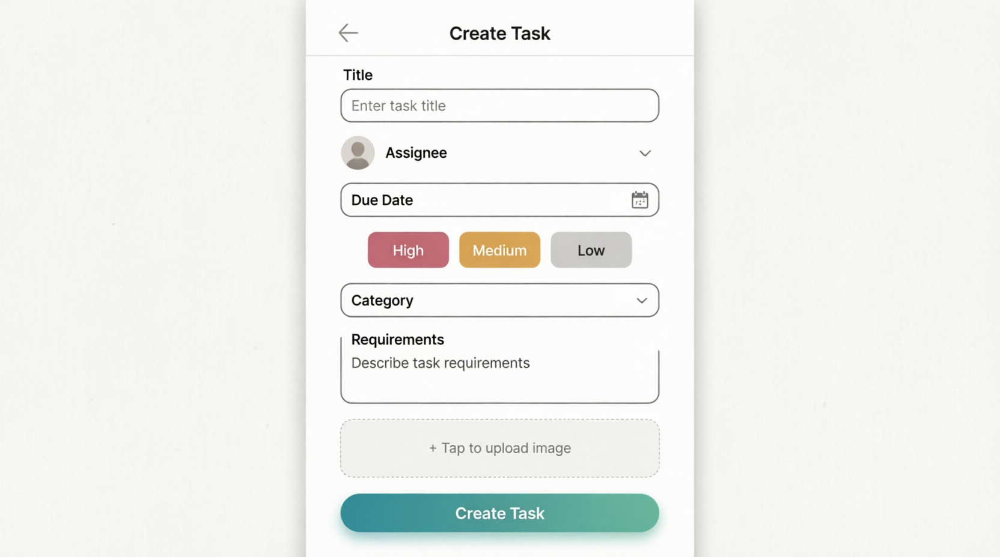
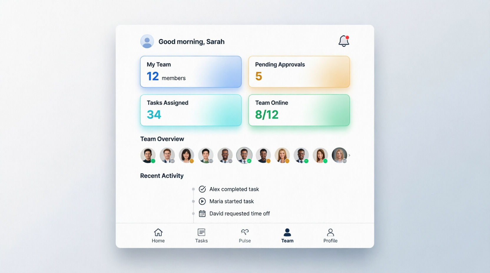

<div align="center">

# 🌊 NexusFlow AI

### Where teams flow together

A full-stack, multi-tenant task & business management platform — a **Flutter** client backed by a **FastAPI** API, with role-based access control, live team presence, financial tracking, and analytics built in.

[](https://flutter.dev)
[](https://fastapi.tiangolo.com)
[](https://www.postgresql.org)
[](https://www.sqlalchemy.org)
[](#license)

</div>

---

## 📖 Table of Contents

- [Overview](#-overview)
- [Screenshots](#-screenshots)
- [Features](#-features)
- [Tech Stack](#-tech-stack)
- [Project Structure](#-project-structure)
- [Getting Started](#-getting-started)
- [Environment Variables](#-environment-variables)
- [API Reference](#-api-reference)
- [Roadmap](#-roadmap)
- [License](#-license)

---

## 🧭 Overview

NexusFlow AI is a team task manager built for small businesses that need more than a to-do list — assignment, accountability, payments, and reporting all in one place. Every company gets its own isolated workspace, every user gets a role that governs what they can see, and every task can carry a client, a deadline, a price tag, and a photo.

The same backend powers a single Flutter codebase that ships to **Android, iOS, Web, Windows, macOS, and Linux**.

## 📸 Screenshots

<div align="center">
<table>
<tr>
<td align="center" width="33%"><br/><sub><b>Splash</b></sub></td>
<td align="center" width="33%"><br/><sub><b>Dashboard</b></sub></td>
<td align="center" width="33%"><br/><sub><b>Task Board</b></sub></td>
</tr>
<tr>
<td align="center"><br/><sub><b>Task Detail</b></sub></td>
<td align="center"><br/><sub><b>Team</b></sub></td>
<td align="center"><br/><sub><b>Analytics</b></sub></td>
</tr>
</table>
</div>

More reference designs are available in [`layout desing/`](layout%20desing).

## ✨ Features

| | Feature | Description |
|---|---|---|
| ✅ | **Task Management** | Create, assign, and track tasks with categories, priorities, statuses, due dates, requirement checklists, and photo attachments |
| 👥 | **Team & Roles** | Hierarchical, multi-company user model with three roles — **Owner**, **Admin**, **Employee** — enforced at the API level |
| 🟢 | **Live Presence** | Heartbeat-based "last seen" tracking so teams know who's active right now |
| 💰 | **Financials** | Per-task payment amounts and paid status, plus salary/rate tracking — locked to Owner-level access |
| 📊 | **Analytics** | Reporting endpoints for task throughput and team performance |
| 🏢 | **Multi-Tenant** | Each company gets its own ID namespace, so one deployment can host many organizations |
| 🖼️ | **Image Uploads** | Pluggable storage — Cloudinary, Qiniu, AWS S3, or Supabase |
| 🔐 | **Secure Auth** | JWT-based authentication with encrypted local token storage on the client |

## 🛠 Tech Stack

<table>
<tr>
<td valign="top" width="50%">

**Frontend** — `frontend/`
- Flutter 3 / Dart, targeting Android, iOS, Web, Windows, macOS, Linux
- [Riverpod](https://riverpod.dev) (`hooks_riverpod`, `flutter_riverpod`) for state management
- [`go_router`](https://pub.dev/packages/go_router) for navigation
- [`dio`](https://pub.dev/packages/dio) for HTTP networking
- `flutter_secure_storage` / `shared_preferences` for local storage
- `flutter_dotenv` for environment configuration

</td>
<td valign="top" width="50%">

**Backend** — `backend/`
- [FastAPI](https://fastapi.tiangolo.com) + Uvicorn
- SQLAlchemy ORM with Alembic migrations
- PostgreSQL database
- JWT auth (`python-jose`, `passlib`, `argon2-cffi`)
- Cloudinary / Qiniu for image storage

</td>
</tr>
</table>

## 📁 Project Structure

```
.
├── backend/                    FastAPI application
│   ├── app/
│   │   ├── api/endpoints/      auth · users · tasks · financials · analytics · companies
│   │   ├── core/                config · security · RBAC · logging
│   │   ├── crud/                 database access layer
│   │   ├── models/               SQLAlchemy models
│   │   └── schemas/              Pydantic request/response schemas
│   ├── alembic/                  database migrations
│   └── requirements.txt
│
├── frontend/                   Flutter application
│   └── lib/
│       ├── core/                 networking · routing · theme · storage
│       └── features/             auth · tasks · team · finance · analytics · presence · profile
│
├── assets/screenshots/         README preview images
└── layout desing/               original UI reference designs
```

## 🚀 Getting Started

### Prerequisites

| Requirement | Version |
|---|---|
| Python | 3.12+ |
| PostgreSQL | any recent version |
| Flutter SDK | ^3.10 |

### 1. Backend Setup

```bash
cd backend
python -m venv venv
source venv/bin/activate          # Windows: venv\Scripts\activate
pip install -r requirements.txt

# Configure environment
cp .env.example .env
# → edit .env with your DATABASE_URL, SECRET_KEY, and storage credentials

# Run database migrations
alembic upgrade head

# Start the API
uvicorn app.main:app --reload
```

The API runs at **`http://localhost:8000`**, with interactive Swagger docs at **`/docs`** (when `DEBUG=True`).

### 2. Frontend Setup

```bash
cd frontend
flutter pub get

# Configure environment — create frontend/.env:
echo "API_BASE_URL=http://127.0.0.1:8000/api" > .env

flutter run
```

## 🔑 Environment Variables

**Backend** — `backend/.env` (see `backend/.env.example` for the full template)

| Variable | Description |
|---|---|
| `DATABASE_URL` | PostgreSQL connection string |
| `SECRET_KEY` | JWT signing secret |
| `FRONTEND_URL` | Allowed CORS origin |
| `IMAGE_STORAGE_STRATEGY` | `cloudinary` \| `qiniu` \| `aws` \| `supabase` |
| `CLOUDINARY_*` / `QINIU_*` / `AWS_*` / `SUPABASE_*` | Credentials for the selected storage provider |

**Frontend** — `frontend/.env`

| Variable | Description |
|---|---|
| `API_BASE_URL` | Base URL of the backend API |
| `API_TIMEOUT_SECONDS` | Request timeout, in seconds |

## 📡 API Reference

Once the backend is running with `DEBUG=True`, full interactive API documentation is available at:

- **Swagger UI** → `http://localhost:8000/docs`
- **ReDoc** → `http://localhost:8000/redoc`

Core route groups:

| Prefix | Purpose |
|---|---|
| `/auth` | Login, token refresh |
| `/users` | User management |
| `/tasks` | Task CRUD, assignment, comments |
| `/financials` | Payment & salary data (Owner-only) |
| `/analytics` | Reporting endpoints |
| `/companies` | Multi-tenant company management |

## 🗺 Roadmap

- [ ] AWS S3 / Supabase storage integration (fields exist, provider pending)
- [ ] Push notifications
- [ ] Expanded analytics dashboards

## 📄 License

No license has been specified for this project yet. All rights reserved by the author unless stated otherwise.
